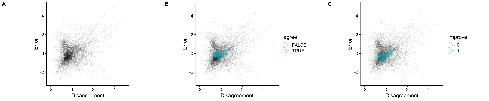
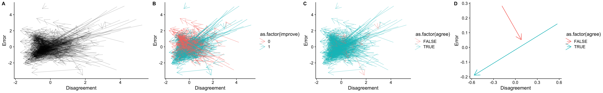
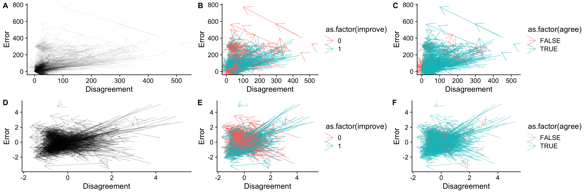

# convergence-valence_space

(A) Normalised all group movement. (B) Averaged movement of positive/ negative agreement group. Thickness represent number of cases. (C) Averaged movement of improved/ impaired performance group. Thickness represent number of cases.

Figures without normalisation have been removed. The right one (D) repersent average movement.

--------
If our aim is to visualize the impact of group discussion as movement, trajectories would be the ideal representation. As each group has two observations, this would result in paired samples for each group, represented as lines (with arrows for orientation).

Dimensions 1: The extent of agreement within the group, represented as variance. (actually means Disagreement in x-axis)

Dimensions 2: The average positivity/negativity of the group, calculated as the group's average distance from individual answers to the truth. (actually means Error in y-axis)

For more clear information, arrows were break down by whether improved group information (column 2) and whether formed group agreement (column 3).
You can get the same information by identify the orientation of arrows. The second column align with up or down, whilst third column align with left or right.

For more reasonable comparation between with differen question, normalisation (z-score in the question) has been employed in second row. 

