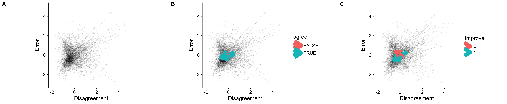
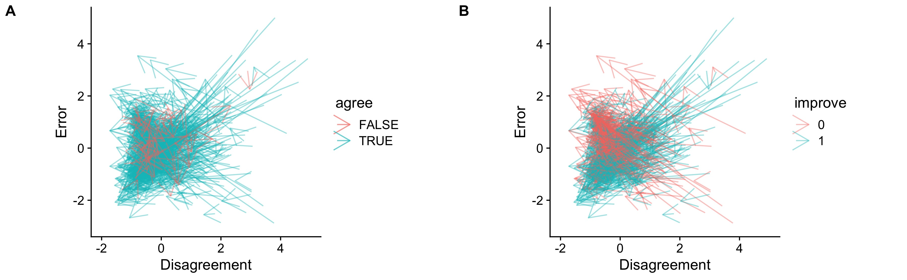

# Group Discussion

People discuss when they didn't sure about some thing. Some times they can align with a same answers, some times they cannot. The thing is whether the agreement is reached matter in terms of the group decision?

Silver, Mellers and Tetlock (2021) found that group interactions were likelier to yield increased accuracy if more accurate members being more confident in their own judgment and less accurate members less confident. By visuialising the discussion outcome, we can see this efferent driven by what kind of group.

# Visualise

We use an arrow to represent the discussion process. That is an arrow form the pre-test point to post-test. The y-axis refer to Error, which is z-score (normalised in question level) of absolute difference value between the average answer of group and the correct answer. The x-axis refer to Disagreement, which is z-score (normalised in question level) of standard deviation of group's answer. In other word, we have an arrow for each group in every question, form point1 to point2: point1 = (Deviation_Time1, Error_Time1) point2 = (Deviation_Time2, Error_Time2)

The left figure (A) present all arrows in study 1. The medial figure (B) present an average movement of the group who reduced deviation (group's answer converged) or the group who increased deviation (group's answer diverged). The right figure (C) present an average movement of the group who improved performance (averaged group's answer) or the group who impaired performance. The thickness represent the case number.

We can see there rarely are group didn't reached agreement (57 vs 670), and even they didn't align with each other, their averaged performance are improved. However, there are considerable group didn't improved their performance (276 vs 451).

The arrow of positive agreement group is much longer than negative agreement group, which means most of them were aware of some information they lacked or some reasonable inference during the discussion. In terms of negative agreement group, there averaged movement is much shorter, and hard to say have a orientation. That means those group are not luck enough to get information or reasonable inference during the discussion, rather than they really have different opinions and become to polarization.

We breaked down this two kind of class to show how they changed their answer.

In case of agreement (A), most of them are wandering. In case of improvement (B), there are lots of group significant aligned with each other to get better or worse.

# Reference

Silver, I., Mellers, B.A. and Tetlock, P.E. (2021) 'Wise teamwork: Collective confidence calibration predicts the effectiveness of group discussion', *Journal of Experimental Social Psychology*, 96, p. 104157. Available at: <https://doi.org/10.1016/j.jesp.2021.104157>
